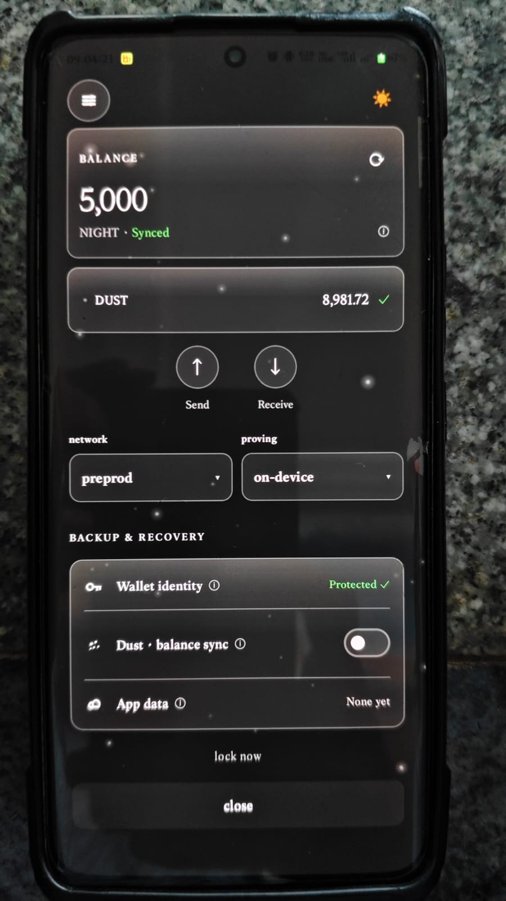
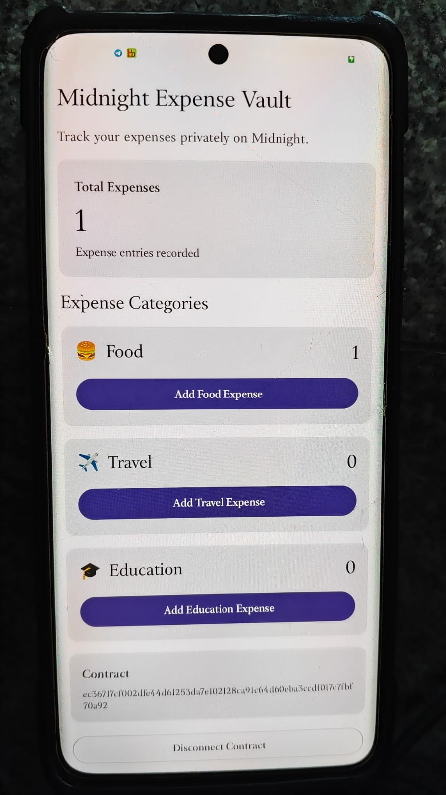

## Proof of Deployment and On-Chain Interaction

### Wallet and Dust Registration

The embedded wallet was successfully synchronized on Midnight PreProd and Dust was registered before deploying the contract.

The wallet panel shows:

- Network: Midnight PreProd
- Proving: On-device
- NIGHT balance: 5,000
- Dust balance: 8,981.72
- Dust registration completed successfully



---

### Contract Deployment and Circuit Execution

The Expense Vault Compact contract was deployed from the Android DApp on Midnight PreProd.

The application then executed the `addFoodExpense()` circuit successfully.

The resulting on-chain ledger state shown in the application is:

- Total Expenses: 1
- Food: 1
- Travel: 0
- Education: 0



---

## Deployed Contract

**Network:** Midnight PreProd

**Contract Address:**

```text
ec36717cf002dfe44d61253da7e102128ca91c64d60eba3ccdf017c7fbf70a92


---

# 3. I'd also add a nice visual demo near the top

Your README currently starts with the project title and description.

Right after the description, add:

```markdown
## 📱 Application Demo

<p align="center">
  
</p>

<p align="center">
  <b>Midnight Expense Vault running on Midnight PreProd</b>
</p>

## Architecture

```text
┌──────────────────────────────┐
│      Android Application     │
│      Kotlin + Compose        │
└──────────────┬───────────────┘
               │
               ▼
┌──────────────────────────────┐
│       Kuira Android SDK      │
│   Embedded Midnight Wallet   │
└──────────────┬───────────────┘
               │
               │ Deploy / Call
               ▼
┌──────────────────────────────┐
│       Midnight PreProd       │
│                              │
│   Expense Vault Contract     │
│                              │
│  foodExpenses                │
│  travelExpenses              │
│  educationExpenses           │
└──────────────────────────────┘


---

